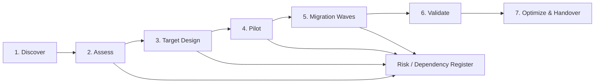

# VMware to OpenStack Migration Framework

[](#)
[](#)
[](#)

A structured **assessment and migration-planning framework** for moving suitable virtual-machine workloads from VMware-based environments to OpenStack/KVM, extended with a dedicated database-cloud-migration architecture project.

> **Positioning:** These are reference migration frameworks and portfolio labs. They do not imply that every VMware workload or database can be migrated directly to a new platform. Each workload requires technical, business, licensing and support validation.

## Migration principles

1. **Discover before designing.** Inventory compute, storage, network, OS, application, database, dependencies, backup, licensing and operational requirements.
2. **Classify workloads.** Not every VM or database should follow the same migration method.
3. **Design the target first.** Networking, storage, identity, images, flavors, database services, HA and operations must be ready before bulk migration.
4. **Migrate in waves.** Start with representative low-risk workloads.
5. **Define rollback before cutover.** Rollback requires protected source state and data-consistency rules.
6. **Validate business service, not only VM boot.** Application, data, integrations, monitoring and backup must pass acceptance criteria.
7. **Complete operational handover.** Monitoring, patching, backup, incident response and ownership must work on the target.

## End-to-end methodology



## Workload disposition

| Disposition | Meaning |
|---|---|
| Rehost | Move workload with minimal application change where compatible |
| Replatform | Adjust OS, storage, network, middleware or service model |
| Refactor | Redesign application/data components where value justifies it |
| Retain | Keep on current platform for dependency, support, licensing or risk reasons |
| Retire | Decommission obsolete workload |
| Replace | Move capability to another product/SaaS/platform |

## Assessment dimensions

### Compute and virtualization

- vCPU/RAM utilization rather than configured values only;
- CPU pinning/NUMA/huge-page requirements;
- GPU/accelerator needs;
- unsupported guest OS or drivers.

### Storage and data

- VMDK/data volume and growth;
- performance/latency profile;
- shared disk or clustering dependencies;
- backup/snapshot behavior;
- target Cinder/Ceph/SAN or database storage capabilities;
- migration transfer duration and change rate.

### Network and integrations

- VLAN/port-group mapping;
- IP preservation versus re-addressing;
- firewall/security policy;
- load balancers, NAT and DNS;
- east-west application dependencies;
- target Neutron/cloud network model.

### Application, database and operations

- owner and criticality;
- maintenance window and downtime tolerance;
- RTO/RPO;
- upstream/downstream dependencies;
- database engine/version/licensing;
- monitoring, backup and patching;
- acceptance test and rollback owner.

## Portfolio projects in this repository

### [VMware to OpenStack Migration Framework](.)
VM discovery, target assessment, migration-wave planning, rollback and operational transition with inventory templates and a deterministic readiness-reporting script.

### [Database Cloud Migration Architecture](projects/database-cloud-migration-architecture)
Database-focused migration framework covering engine/version discovery, performance baseline, migration-path selection, replication/CDC, target HA/DR, cutover, validation, rollback and a Python inventory assessor.

## Repository structure

```text
.
├── README.md
├── docs/
├── templates/
├── scripts/
├── projects/
│   └── database-cloud-migration-architecture/
└── .github/workflows/
```

## Migration-wave criteria

Prefer early waves with:

- known owners;
- complete dependency information;
- supported OS/application/database stack;
- manageable data size/change rate;
- clear maintenance window;
- straightforward rollback;
- measurable acceptance tests;
- low blast radius.

Later waves can address higher criticality, larger data sets, complex integrations and special performance requirements after the target platform and migration process are proven.

## Cutover acceptance

Validate:

- OS/application/database health;
- data integrity and engine-appropriate consistency;
- DNS/network reachability;
- firewall/security controls;
- integrations and scheduled jobs;
- monitoring/logging;
- backup/recovery;
- performance baseline;
- application/data owner acceptance.

## Related projects

- [OpenStack Private Cloud Reference Architecture](https://github.com/DeeSanas/openstack-private-cloud-reference-architecture)
- [Hybrid Cloud Reference Architecture](https://github.com/DeeSanas/hybrid-cloud-reference-architecture)
- [Data Center EVPN-VXLAN Architecture](https://github.com/DeeSanas/datacenter-evpn-vxlan-architecture)

## Roadmap

- [x] VMware/OpenStack migration methodology
- [x] Discovery questionnaire and workload/wave templates
- [x] Readiness reporting script and CI
- [x] Database cloud migration architecture
- [x] Database migration inventory assessor and CI
- [ ] Add anonymized assessment data sets
- [ ] Add target flavor mapping and migration duration estimator
- [ ] Add cutover/rollback runbook templates
