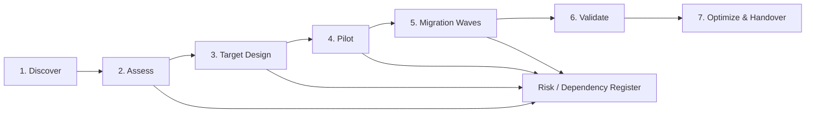

# VMware to OpenStack Migration Framework

[](#)
[](#)
[](#)

A structured **assessment and migration-planning framework** for moving suitable virtual-machine workloads from VMware-based environments to OpenStack/KVM.

The project focuses on discovery, workload classification, dependency mapping, compatibility analysis, target design, migration-wave planning, validation, rollback and operational transition. It deliberately avoids implying that VM conversion alone constitutes a successful migration.

> **Positioning:** This is a reference migration framework and portfolio lab. It is not a claim that every VMware workload can be moved directly to OpenStack, and it is not evidence of a particular customer migration. Each workload requires technical and business validation.

## Migration principles

1. **Discover before designing.** Inventory compute, storage, network, OS, application, dependencies, backup, licensing and operational requirements.
2. **Classify workloads.** Not every VM should follow the same migration method.
3. **Design the target first.** OpenStack networking, storage, identity, images, flavors, quotas, availability zones and operations must be ready before bulk migration.
4. **Migrate in waves.** Start with representative low-risk workloads and use lessons learned to refine later waves.
5. **Define rollback before cutover.** Rollback is a designed path with data-consistency implications, not an improvised decision during an outage.
6. **Validate business service, not only VM boot.** Application, data, integrations, monitoring, backup and security must pass acceptance criteria.
7. **Complete operational handover.** Monitoring, patching, backup, incident response and ownership must work on the target platform.

## End-to-end methodology



## Workload disposition

A VMware inventory should not automatically become an equal-sized OpenStack inventory. Each workload can be assigned a disposition such as:

| Disposition | Meaning |
|---|---|
| Rehost | Move the VM with minimal application change where compatible |
| Replatform | Adjust OS, storage, network, middleware or deployment method for the target platform |
| Refactor | Redesign application components where business value justifies it |
| Retain | Keep on VMware/on-prem for dependency, support, licensing or risk reasons |
| Retire | Decommission obsolete or duplicate workload |
| Replace | Move capability to another product/SaaS/platform instead of migrating the VM |

## Assessment dimensions

### Compute

- vCPU/RAM utilization rather than configured values only;
- CPU pinning/NUMA/huge-page requirements;
- virtual hardware dependencies;
- GPU/accelerator needs;
- unsupported guest OS or drivers.

### Storage

- VMDK layout and total used data;
- performance/latency profile;
- shared-disk or clustering dependencies;
- snapshot/backup behavior;
- target Cinder/Ceph/SAN capabilities;
- migration data-transfer duration.

### Network

- source VLAN/port-group mapping;
- IP preservation versus re-addressing;
- firewall/security policy;
- load balancers and NAT;
- DNS dependencies;
- east-west application dependencies;
- target Neutron network model.

### Application and operations

- application owner and criticality;
- maintenance window;
- RTO/RPO;
- upstream/downstream dependencies;
- licensing/support implications;
- monitoring, backup and patching;
- acceptance test and rollback owner.

## Repository structure

```text
.
├── README.md
├── docs/
│   ├── methodology.md
│   ├── discovery-questionnaire.md
│   └── decision-matrix.md
├── templates/
│   ├── workload-inventory.csv
│   └── wave-plan.csv
├── scripts/
│   └── readiness_report.py
└── .github/workflows/python.yml
```

## Readiness toolkit

The Python script performs a simple, transparent quality check on the workload inventory:

```bash
python scripts/readiness_report.py templates/workload-inventory.csv
```

It reports missing required data and summarizes migration dispositions/risk flags. The tool is intentionally deterministic and does not claim to replace engineering assessment.

## Migration-wave criteria

Prefer pilot/early waves that have:

- known owners;
- complete dependency information;
- supported OS/application stack;
- manageable data size;
- clear maintenance window;
- straightforward rollback;
- measurable acceptance test;
- low blast radius.

Later waves can address higher criticality, larger data sets, complex integrations or special performance requirements after the target platform and process are proven.

## Cutover acceptance

A workload is not complete merely because the instance starts. Validate:

- boot and OS health;
- application service health;
- database/data integrity where applicable;
- DNS and network reachability;
- firewall/security controls;
- integration endpoints;
- monitoring/logging;
- backup/recovery;
- performance baseline;
- application-owner acceptance.

## Related projects

- [OpenStack Private Cloud Reference Architecture](https://github.com/DeeSanas/openstack-private-cloud-reference-architecture)
- [Hybrid Cloud Reference Architecture](https://github.com/DeeSanas/hybrid-cloud-reference-architecture)
- [Data Center EVPN-VXLAN Architecture](https://github.com/DeeSanas/datacenter-evpn-vxlan-architecture)

## Roadmap

- [x] Migration methodology
- [x] Discovery questionnaire
- [x] Workload and wave templates
- [x] Readiness reporting script
- [x] CI check for Python toolkit
- [ ] Add sample anonymized assessment dataset
- [ ] Add target flavor-mapping helper
- [ ] Add migration duration estimator
- [ ] Add cutover/rollback runbook template
