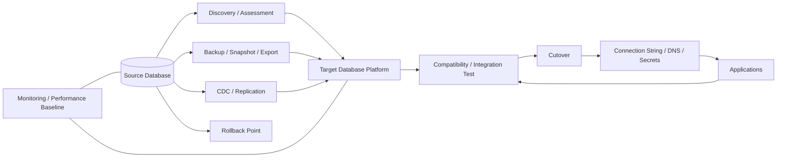

# Database Cloud Migration Reference Architecture

A structured reference architecture for assessing and migrating enterprise databases from traditional data-center environments to cloud or private-cloud target platforms.

The project focuses on **discovery, dependency mapping, compatibility, data-transfer strategy, cutover, validation, rollback, HA/DR and operational transition** rather than treating database migration as a simple export/import task.

> This is a reference framework and lab. Database-engine support, licensing, replication features, downtime, data-loss tolerance, encryption, performance and vendor support must be validated for the actual platform and version.

## Migration paths

| Path | Description | Typical use |
|---|---|---|
| Rehost | Move DB VM largely unchanged | Low-change infrastructure migration |
| Replatform | Move to managed/native DB service with limited app changes | Reduce operational overhead |
| Upgrade & migrate | Change DB version during migration | Lifecycle modernization where risk is controlled |
| Replicate & cut over | Continuous replication followed by planned cutover | Lower downtime requirements |
| Refactor data layer | Redesign schema/data-access architecture | Strategic application modernization |
| Retain | Keep database on existing platform | Licensing, latency, dependency or support constraints |

## Logical migration architecture



Editable source: [`diagrams/db-migration.mmd`](diagrams/db-migration.mmd).

## Assessment dimensions

- database engine, version, edition and licensing;
- total size, growth rate and change rate;
- CPU, memory, IOPS, throughput and latency baseline;
- HA/cluster/replication topology;
- stored procedures, extensions, agents and external jobs;
- application connection methods and hard-coded endpoints;
- data encryption and key-management requirements;
- backup, retention and point-in-time recovery;
- RTO, RPO and maximum acceptable downtime;
- upstream/downstream integrations;
- compliance, residency and audit requirements;
- target service limits and feature gaps.

## Migration phases

1. **Discover** database estate and ownership.
2. **Classify** engine/version, criticality and migration disposition.
3. **Benchmark** source performance and recovery characteristics.
4. **Design target** compute/service tier, storage, HA, backup, network and security.
5. **Select data movement**: backup/restore, replication, CDC or native migration tooling.
6. **Rehearse** migration on a representative copy.
7. **Cut over** with freeze, final sync, validation and owner approval.
8. **Observe** performance and error rates during stabilization.
9. **Decommission** source only after rollback window expires.

## Cutover acceptance

- row/object counts or engine-appropriate consistency checks;
- application transactions succeed;
- integrations and scheduled jobs run;
- security roles/permissions are correct;
- monitoring and backups are active;
- performance is within agreed tolerance;
- replication lag is zero/acceptable at cutover;
- rollback point remains protected until formal acceptance.

## Included toolkit

[`templates/database-inventory.csv`](templates/database-inventory.csv) provides a small example inventory format. [`scripts/assess_database.py`](scripts/assess_database.py) checks for missing migration-critical data and highlights high-risk characteristics.

```bash
python scripts/assess_database.py templates/database-inventory.csv
```

The script is intentionally deterministic; it does not replace database-engine-specific assessment tools or specialist review.